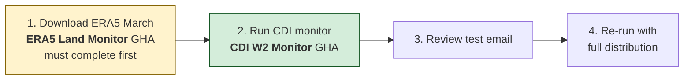
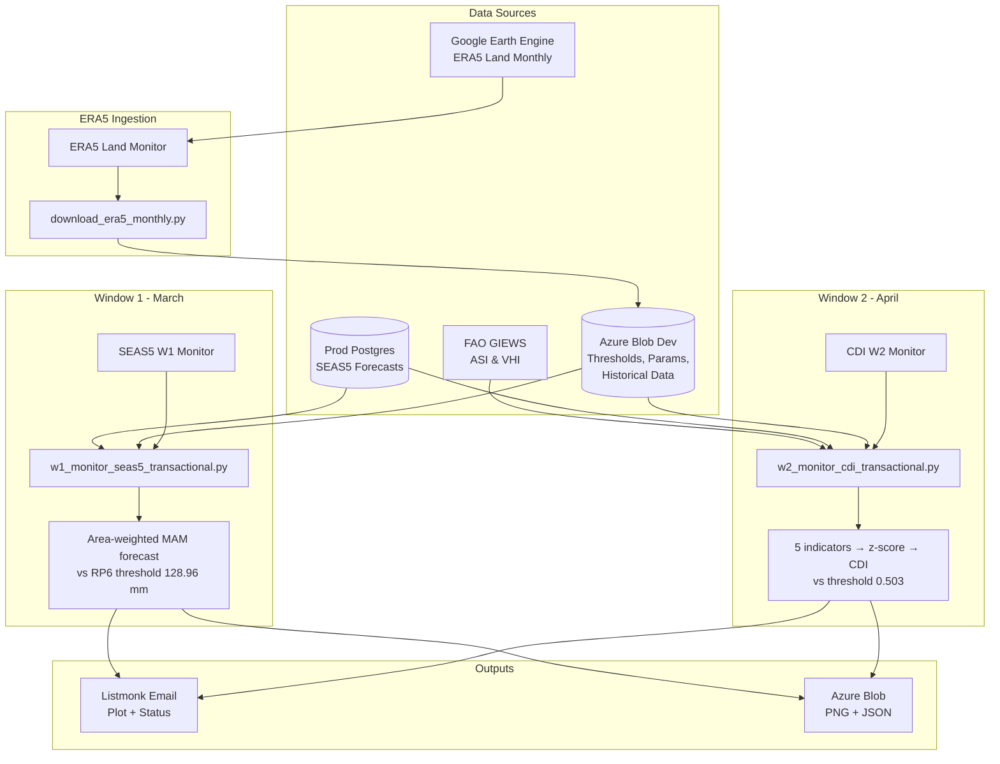
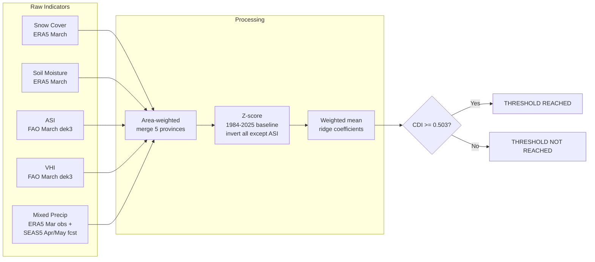

# Monitoring Workflows

Automated drought trigger monitoring for the 2026 Anticipatory Action framework in Afghanistan. Two trigger windows evaluate independent drought signals using OR logic — a year triggers if **either** window fires.

All workflows are **manual dispatch only** (no cron). Trigger them from the Actions tab on GitHub or via `gh workflow run`.

## How to Run Monitoring (Step by Step)

### March: Window 1 (SEAS5 forecast)

SEAS5 March-issued forecasts are available on the **5th of March**.

1. **Dispatch** `SEAS5 W1 Monitor (2026)` from GitHub Actions
2. Set `test: true` and `email_group: core_developer` for a test run
3. Review the email, then re-run with `test: false` and the desired `email_group`

No data ingestion step needed — W1 reads SEAS5 directly from the prod database.

### April: Window 2 (CDI)

W2 requires ERA5 March data to be downloaded first — this is a separate workflow that must complete before the CDI monitor can run. SEAS5 April-issued forecasts are available on the **5th of April**. ERA5 March data is typically available ~7 days after month end. FAO March dekad 3 data is usually available in the first week of April.

1. **Download ERA5 March data**: dispatch `ERA5 Land Monitor` with `year` and `month: 3`. Wait for it to complete.
2. **Dispatch** `CDI W2 Monitor (2026)` from GitHub Actions
3. Set `test: true` and `email_group: core_developer` for a test run
4. Review the email, then re-run with `test: false` and the desired `email_group`



### Data Availability Timeline

| Data | Typical availability | Needed for |
|---|---|---|
| SEAS5 March forecast | March 5 | W1 |
| SEAS5 April forecast | April 5 | W2 |
| ERA5 Land March | ~April 7 | W2 (must download first via ERA5 Land Monitor) |
| FAO ASI/VHI March dekad 3 | ~April 1-7 | W2 (fetched live by CDI script) |

## Pipeline Overview



## Workflows

### ERA5 Land Monitor (`era5_land_monitor.yaml`)

Monthly ingestion of ERA5 Land zonal statistics from Google Earth Engine.

| | |
|---|---|
| **Script** | `src/trigger_monitoring/download_era5_monthly.py` |
| **Dispatch inputs** | `year`, `month` (defaults to previous month) |
| **Output** | `monitoring_inputs/{year}/{month}/era5_land.parquet` on blob |
| **Secrets** | `GEE_SERVICE_ACCOUNT_KEY`, `DSCI_AZ_BLOB_DEV_SAS_WRITE` |

### Window 1: SEAS5 (`w1_seas5_monitor.yaml`)

March seasonal precipitation forecast trigger.

| | |
|---|---|
| **Script** | `src/monitoring_2026/w1_monitor_seas5_transactional.py` |
| **Dispatch inputs** | `year`, `test`, `email_group` |
| **Trigger logic** | Area-weighted MAM forecast <= 128.96 mm (RP6) |
| **Provinces** | Faryab, Sar-e-Pul, Jawzjan, Balkh, Badghis |
| **Data sources** | SEAS5 from prod DB, thresholds + area weights from blob |
| **Secrets** | `DSCI_AZ_DB_PROD_*`, `DSCI_AZ_BLOB_DEV_*`, `DSCI_LISTMONK_*` |

### Window 2: CDI (`w2_cdi_monitor.yaml`)

April Combined Drought Indicator trigger.

| | |
|---|---|
| **Script** | `src/monitoring_2026/w2_monitor_cdi_transactional.py` |
| **Dispatch inputs** | `year`, `test`, `email_group` |
| **Trigger logic** | CDI >= 0.503 (~RP4) |
| **Provinces** | Same 5, area-weighted to single regional value |
| **Data sources** | ERA5 from blob, FAO ASI/VHI from HTTP, SEAS5 from prod DB |
| **Prerequisite** | ERA5 March data must be downloaded first (see above) |
| **Secrets** | Same as W1 |

## CDI Computation



### CDI Weights (ridge regression, ch12/ch13)

| Component | Weight |
|---|---|
| Mixed obs/forecast precip | 0.275 |
| ASI | 0.206 |
| Snow cover | 0.205 |
| VHI | 0.192 |
| Soil moisture | 0.121 |

## Blob Artifacts

All on **dev** stage, `projects` container, prefix `ds-aa-afg-drought/`.

**One-time artifacts** (created by rendering `book_afg_analysis/13_2026_trigger_proposal.qmd`):

| Artifact | Path |
|---|---|
| Trigger thresholds + CDI weights | `monitoring_inputs/2026/trigger_thresholds.parquet` |
| CDI distribution params (mu/sigma) | `monitoring_inputs/2026/cdi_distribution_params.parquet` |
| Historical CDI timeseries (for plot) | `monitoring_inputs/2026/cdi_historical_timeseries.parquet` |
| Area weights (province shape_area) | `raw/vector/historical_era5_land_ndjfmam_lte2025.parquet` |
| Email distribution list | `monitoring_inputs/2026/distribution_list.csv` |

**Recurring artifacts** (created by workflows):

| Artifact | Path | Created by |
|---|---|---|
| ERA5 monthly zonal stats | `monitoring_inputs/{year}/{month}/era5_land.parquet` | ERA5 Land Monitor |
| Monitoring plot | `monitoring_outputs/{year}/*_monitor.png` | W1 / W2 Monitor |
| Monitoring summary | `monitoring_outputs/{year}/*_summary.json` | W1 / W2 Monitor |

## GitHub Secrets Required

| Secret | Used by | Description |
|---|---|---|
| `DSCI_AZ_DB_PROD_PW` | W1, W2 | Prod postgres password |
| `DSCI_AZ_DB_PROD_UID` | W1, W2 | Prod postgres username |
| `DSCI_AZ_DB_PROD_HOST` | W1, W2 | Prod postgres host |
| `DSCI_AZ_BLOB_DEV_SAS` | W1, W2 | Azure blob read (dev) |
| `DSCI_AZ_BLOB_DEV_SAS_WRITE` | W1, W2, ERA5 | Azure blob write (dev) |
| `DSCI_LISTMONK_API_KEY` | W1, W2 | Listmonk API key |
| `GEE_SERVICE_ACCOUNT_KEY` | ERA5 | GEE service account JSON |

| Variable | Used by | Description |
|---|---|---|
| `DSCI_LISTMONK_API_USERNAME` | W1, W2 | Listmonk API username |

## Local Testing

Scripts can be run locally with the `--dry-run` flag (skips blob upload and email):

```bash
# W2 CDI (requires ERA5 March data on blob)
uv run python src/monitoring_2026/w2_monitor_cdi_transactional.py --year 2026 --dry-run

# ERA5 download (requires GEE auth via `earthengine authenticate`)
uv run python src/trigger_monitoring/download_era5_monthly.py --year 2026 --month 3
```
