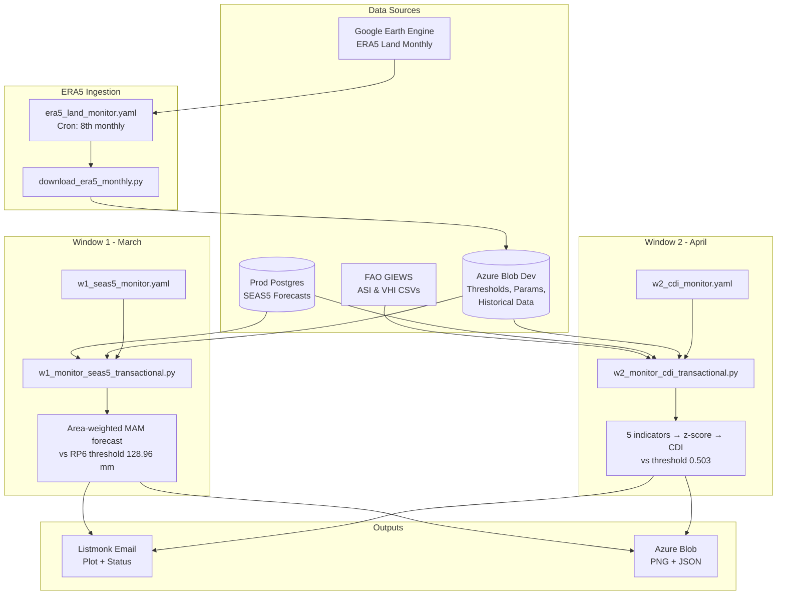
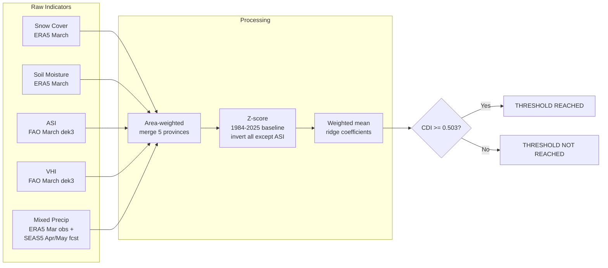

# Monitoring Workflows

Automated drought trigger monitoring for the 2026 Anticipatory Action framework in Afghanistan. Two trigger windows evaluate independent drought signals using OR logic — a year triggers if **either** window fires.

## Pipeline Overview

## Workflows

### ERA5 Land Monitor (`era5_land_monitor.yaml`)

Monthly ingestion of ERA5 Land zonal statistics from Google Earth Engine.

| | |
|---|---|
| **Script** | `src/trigger_monitoring/download_era5_monthly.py` |
| **Schedule** | Manual dispatch (cron disabled) |
| **Dispatch** | Manual with optional `year` / `month` |
| **Output** | `monitoring_inputs/{year}/{month}/era5_land.parquet` |
| **Secrets** | `GEE_SERVICE_ACCOUNT_KEY`, `DSCI_AZ_BLOB_DEV_SAS_WRITE` |

### Window 1: SEAS5 (`w1_seas5_monitor.yaml`)

March seasonal precipitation forecast trigger.

| | |
|---|---|
| **Script** | `src/monitoring_2026/w1_monitor_seas5_transactional.py` |
| **Schedule** | Manual dispatch (cron disabled) |
| **Trigger logic** | Area-weighted MAM forecast <= 128.96 mm (RP6) |
| **Provinces** | Faryab, Sar-e-Pul, Jawzjan, Balkh, Badghis |
| **Data sources** | SEAS5 from prod DB, thresholds + area weights from blob |
| **Secrets** | `DSCI_AZ_DB_PROD_*`, `DSCI_AZ_BLOB_DEV_*`, `DSCI_LISTMONK_*` |

### Window 2: CDI (`w2_cdi_monitor.yaml`)

April Combined Drought Indicator trigger.

| | |
|---|---|
| **Script** | `src/monitoring_2026/w2_monitor_cdi_transactional.py` |
| **Schedule** | Manual dispatch (cron disabled) |
| **Trigger logic** | CDI >= 0.503 (~RP4) |
| **Provinces** | Same 5, area-weighted to single regional value |
| **Data sources** | ERA5 from blob, FAO ASI/VHI from HTTP, SEAS5 from prod DB |
| **Secrets** | Same as W1 |

## CDI Computation

### CDI Weights (ridge regression, ch12/ch13)

| Component | Weight |
|---|---|
| Mixed obs/forecast precip | 0.275 |
| ASI | 0.206 |
| Snow cover | 0.205 |
| VHI | 0.192 |
| Soil moisture | 0.121 |

## Blob Artifacts

All on **dev** stage, `projects` container, prefix `ds-aa-afg-drought/`.

| Artifact | Path | Created by |
|---|---|---|
| Trigger thresholds + weights | `monitoring_inputs/2026/trigger_thresholds.parquet` | ch13 (one-time) |
| CDI distribution params (mu/sigma) | `monitoring_inputs/2026/cdi_distribution_params.parquet` | ch13 (one-time) |
| Historical CDI timeseries | `monitoring_inputs/2026/cdi_historical_timeseries.parquet` | ch13 (one-time) |
| Area weights | `raw/vector/historical_era5_land_ndjfmam_lte2025.parquet` | data-raw/15 (one-time) |
| ERA5 monthly data | `monitoring_inputs/{year}/{month}/era5_land.parquet` | ERA5 GHA (monthly) |
| Email distribution list | `monitoring_inputs/2026/distribution_list.csv` | Manual |
| Monitoring outputs | `monitoring_outputs/{year}/*.png, *.json` | W1/W2 scripts |

## Dispatch Inputs

Both W1 and W2 workflows accept:

- **year** — framework year (default: current year)
- **test** — prepend `[test]` to email subject (default: true)
- **email_group** — `core_developer` | `developers` | `internal_chd` | `full_list`

The `--dry-run` flag is available on the CLI scripts to skip blob upload and email entirely.
